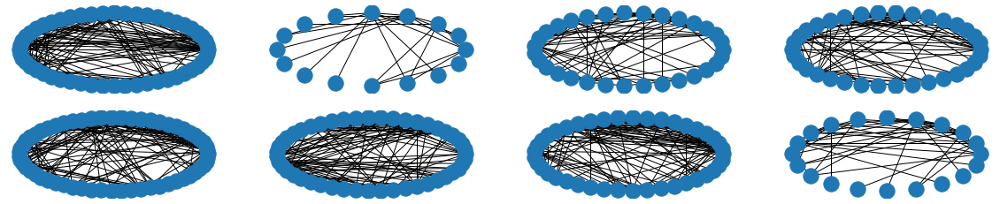

# Deep Graph Generator
Learning a state-based generative model of graph distributions.


Disclaimer: this is currently a work under peer review and only available as preprint.
```bibtex
@misc{stier2020deep,
    title={Deep Graph Generators},
    author={Julian Stier and Michael Granitzer},
    year={2020},
    eprint={2006.04159},
    archivePrefix={arXiv},
    primaryClass={cs.LG}
}
```

# Reproducing Experiments
- install the conda environment with ``conda env create -f environment.yml``
- activate the environment ``conda activate sur-deepgg``
- configure your (hyper)parameters (first ~20 variables)
- invoke as much as possible computations via ``python deepgg_pipeline.py``
- merge the computations as shown in *deepgg-merge-computations.ipynb*
- have a look over the exemplary notebooks of how to visualize some aspects of the computed models
